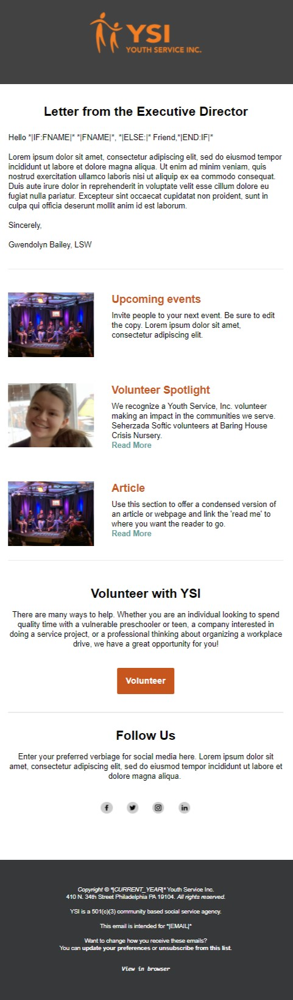
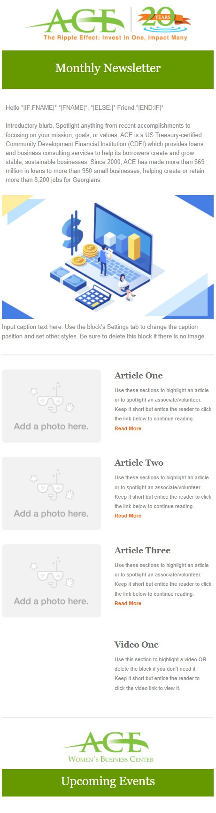
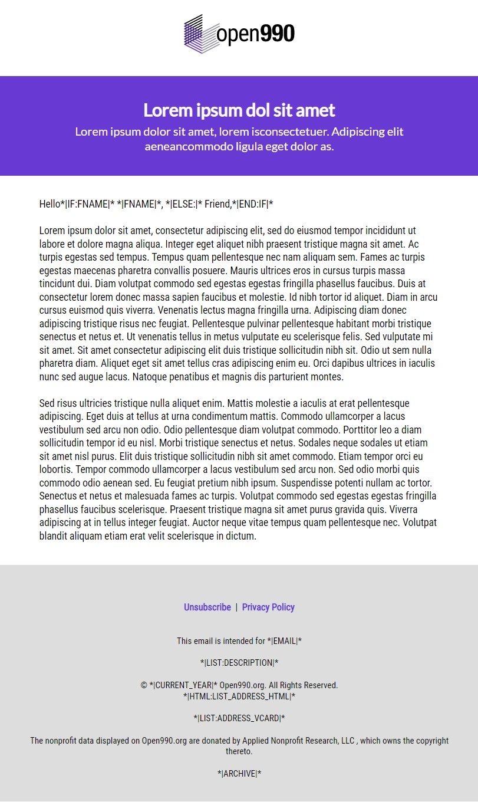
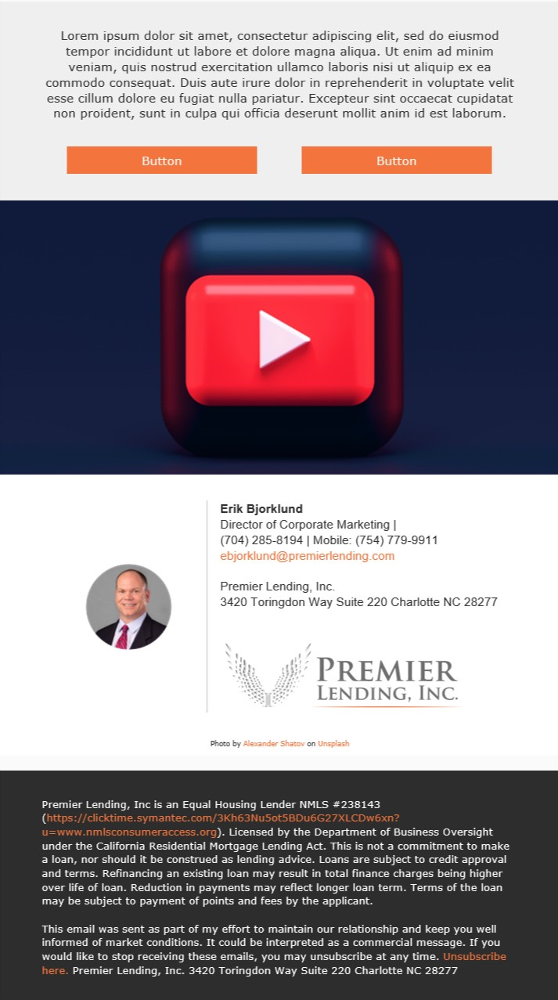
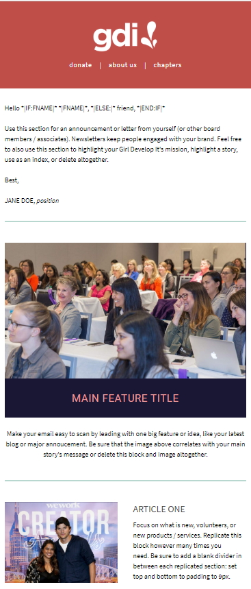

## Note on my current role
In my opinion, some of my best work is with my current contract; however, I am not able to showcase them due to copyright restrictions. While I am not able to display them in this portfolio, I think it is pertinent to describe some of the work and learning experiences I have gained. 

### Boolean logic and custom tags
The CMS platform used for marketing emails allows for Boolean logic within the HTML. The CMS platform's language and logic is based on Velocity / Apache, which allows for Booleans within the HTML. A great use case for this is to check on whether or not a user has a calendar link URL listed in their profile, if so, a specific calendar banner is added to the marketing email. 

Additionally, the CMS platform allows for admins to create their own custom tags, which are similar merge fields in other platforms. A use case would be adding a dropdown selection of third party commentary articles for market volatility-related emails. This allowed me to quickly host assets (PDFs) into the CMS and create a tag that allows the user to choose an article for use within a marketing email. 

### Monthly Newsletter
The company wanted to find a unique way to present financial articles. The previous newsletter had a standard structure and some unresponsive code. After some research, I presented a new format which has an image library to swap the hero image, alternating articles (first section = image, article + CTA (left to right), second section = article + CTA, image (left to right)). 

### Webinar or Digital Event Email 
Prior to joining, Equitable only had an in-person event template. After the onset of covid restrictions, there was a use case to create a similar template but for digital or teleconference events. This template utilizes 14 variable fields that allow the user to dynamically update fields within the creative template like compliance-approved titles, descriptions, dates, start time, end time, conference phone number, guest speaker info, etc. 

### Market Volatility
With the recent turmoil in the global economic landscape, there was a request by our marketing partners to create an email template that would allow users to select one of many different (and approved) third-party commentary articles on market volatility. In the past, a new template would be created for each article; however, the coding queue for these types of requests was cumbersome. Instead, I was able to leverage the CMS platform to allow a user to select a specific third-party article from a list. This drastically reduced the number of replicated templates and was a viable solution since reporting of the email was favored over the reporting which third-party asset was chosen.

## Other email maketing templates
Below are email marketing templates that were coded for either volunteer cases or DBA business requests
| Youth Service Inc.   | ACE   | Open990   | Premier Lending  | Girl Develop It! |
| :---: | :---: | :---: | :---: | :---: |
|  |  |  |  |  |
